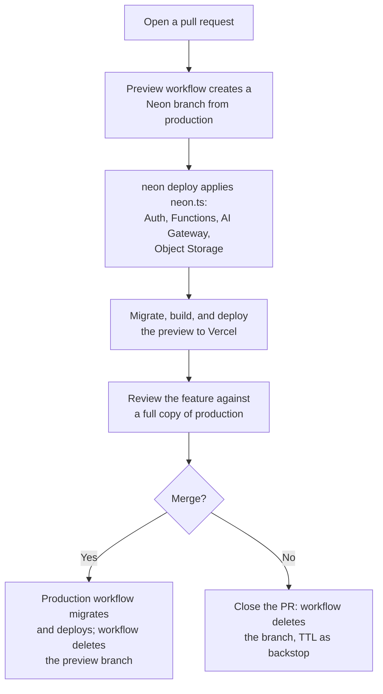

<picture>
  <source media="(prefers-color-scheme: dark)" srcset="https://neon.com/brand/neon-logo-dark-color.svg">
  <source media="(prefers-color-scheme: light)" srcset="https://neon.com/brand/neon-logo-light-color.svg">
  
</picture>

### Branch Everything: Fully Isolated Preview Environments on Neon

A document summarization app where every pull request gets its own production-like copy of the entire backend: Lakebase Postgres, Auth, Functions, AI Gateway, and Object Storage, provisioned and deleted automatically by GitHub Actions.

---

A preview deployment that only deploys your code doesn't tell you much about how a change will behave in production. The preview runs your new code, but everything behind it is still shared: test writes land in your production tables, test signups create real users, and files you upload end up in production buckets. The usual fix is a shared staging environment, but staging drifts out of sync the moment someone deploys to it manually, and everyone's tests collide on the same data.

This repository solves that problem with [**Neon**](https://neon.com/docs/introduction). On Neon, you can [branch](https://neon.com/docs/introduction/branching) your database the same way you branch your code, and everything Neon offers branches with it: [Managed Better Auth](https://neon.com/docs/auth/overview), [Neon Functions](https://neon.com/docs/compute/functions/overview), the [Neon AI Gateway](https://neon.com/docs/ai-gateway/overview), and [Neon Object Storage](https://neon.com/docs/storage/overview). A single `neon.ts` file declares the backend services and branch policy, and the [Neon CLI](https://neon.com/docs/cli/quickstart) provisions every branch from it automatically. Two GitHub Actions workflows complete the loop: for every pull request they create a preview branch, deploy the function from the PR's code, run migrations, and deploy the frontend to Vercel; when you merge, they promote the changes to production and delete the preview branch.

The result: every pull request is reviewed against a full, isolated copy of production — real data, real users, real storage — without touching production at all.

Follow the full guide on [Neon: Branch everything — fully isolated preview environments on Neon](https://neon.com/guides/branch-everything-preview-environments) for a step-by-step walkthrough.

## 📐 Architecture overview



1.  **Preview branch**: On every pull request, the preview workflow creates a `preview/<git-branch>` branch — a copy-on-write fork of production that takes about a second and costs almost nothing. The fork starts as an exact copy: production's rows, users, uploaded files, and function deployments.
2.  **Declarative provisioning**: `neon deploy` applies `neon.ts` to the branch, so it gets its own auth endpoint, its own AI Gateway credentials, its own storage namespace, and a function deployment built from the PR's code at the branch's URL.
3.  **Migrations and preview deploy**: `neon env pull` fetches the branch's variables, `drizzle-kit migrate` applies schema changes to the preview's database only, and the frontend is built with the preview's URLs baked in and deployed to Vercel. The workflow comments the preview URL on the pull request.
4.  **Promote and clean up**: When you merge, the production workflow deploys the function from `main`, runs migrations against production, and deploys the production build to Vercel. The preview branch is deleted, removing everything attached to it; a 7-day TTL on every preview branch is the backstop if the cleanup job can't run.

## ✨ Key features

-   **Full-Stack Branching**: A Neon branch is more than a database fork. Every branch gets its own Lakebase Postgres data, its own auth (users, sessions, config), its own function deployments at branch-scoped URLs, its own AI Gateway credentials, and its own storage namespace.
-   **Copy-on-Write Isolation**: Branches share storage with their parent and only record changes made after the fork, so creating one takes about a second and costs almost nothing — yet test writes, signups, and uploads never touch production.
-   **Declarative Environments**: A single `neon.ts` file declares the backend services and branch policy. The default branch is protected and sized for production; every preview branch gets minimum compute and a 7-day TTL.
-   **Automated Lifecycle**: Two GitHub Actions workflows handle everything — preview branches on pull requests, promotion to production on merge, and branch deletion on close.
-   **Branch-Scoped Credentials**: Auth tokens issued on one branch are invalid on another, function URLs contain the branch ID, and storage credentials point at the branch's endpoint. The same code runs unchanged on every branch.
-   **Reviewable Schema Changes**: Migrations run against the preview branch on every push, so reviewers always see the feature against a schema that matches the code — before it hits production.

## 🚀 Get started

### Prerequisites

Before you start, you'll need:

1.  **[Node.js](https://nodejs.org/)** (v22+, v24 recommended) installed locally.
2.  A **[Neon account](https://console.neon.tech)**. AI Gateway requires a paid plan.
3.  **Neon CLI** installed globally (`npm i -g neon@latest`) and authenticated (`neon auth`).
4.  A **[GitHub](https://github.com)** account and repository for the workflows to run on.
5.  A **[Vercel](https://vercel.com)** account and the Vercel CLI installed globally (`npm i -g vercel@latest`) and authenticated (`vercel login`).

### Initial setup

Clone this repository and install the dependencies.

```bash
# Clone the repository
git clone https://github.com/dhanushreddy291/doc-notes.git
cd doc-notes

# Install dependencies
npm install
```

### Link your Neon project

Link your local workspace to a Neon project. This creates a `.env.local` file with your database connection string and other Neon variables.

```bash
neon link
```

> When creating your Neon project, select the **AWS US East 2 (Ohio)** region (`aws-us-east-2`) or **AWS Europe (Frankfurt)** (`aws-eu-central-1`) since Functions, AI Gateway, and Object Storage are currently available there during beta. Select **Yes** when prompted to manage your setup as code (`neon.ts`), and select **Auth**, **Functions**, **Object Storage**, and **AI Gateway** as the services `neon.ts` should declare.

### Apply the configuration

The `neon.ts` file in this repository declares the backend services and the branch policy: the default branch is protected and sized for production, and every other branch is a disposable preview with minimum compute and a 7-day TTL.

Save it to your project and provision the services by running:

```bash
neon deploy
```

> If `neon deploy` fails because the existing branch's settings differ from your `neon.ts` policy, run `neon deploy --update-existing` to update the branch's settings to match the configuration.

This writes the branch's environment variables to `.env.local`, including `DATABASE_URL`, `NEON_AUTH_BASE_URL`, `NEON_AI_GATEWAY_TOKEN`, and `AWS_ENDPOINT_URL_S3`. Every URL and credential is scoped to the linked branch, which is exactly what makes each branch a complete, isolated environment.

### Run the app locally

Run the function and the frontend on the linked branch:

```bash
# Terminal 1: start the Neon Functions dev server
neon dev

# Terminal 2: start the Vite frontend
npm run dev
```

Open `http://localhost:5173`, sign in with an email address you can check (Neon emails you a one-time code), and upload a text file. The AI-generated summary appears in the list.

### Automate previews and production with GitHub Actions

The workflows in `.github/workflows/` automate the preview and production loop. They authenticate with a Neon API key and Vercel credentials stored as GitHub repository secrets.

Add the secrets and variables to your repository under **Settings → Secrets and variables → Actions**:

1.  `NEON_API_KEY`: Create a Neon API key, see [create an API key](https://neon.com/docs/manage/api-keys#create-an-api-key).
2.  `NEON_PROJECT_ID`: Your project ID (as a **variable**, found in the `.neon` file). The [Neon GitHub integration](https://neon.com/docs/guides/neon-github-integration) can set both up for you.
3.  `VERCEL_TOKEN`, `VERCEL_ORG_ID`, `VERCEL_PROJECT_ID`: Create a Vercel token at [vercel.com/account/tokens](https://vercel.com/account/tokens), then run `vercel link` and `cat .vercel/project.json` to get the org and project IDs.

Then register your domains with Managed Better Auth so sign-in works from previews: add your production URL under **Auth → Configuration → Domains** in the Neon Console, and follow [wildcard domains for previews](https://neon.com/docs/auth/guides/configure-domains#wildcard-domains-for-previews) to trust a pattern like `https://*.vercel.app`.

### Open a pull request

Push a branch and open a pull request. The preview workflow creates the branch, provisions every service on it, runs migrations, and comments the preview URL on the pull request. Sign in, upload a document, and review the feature against a full copy of production.

When you merge, the production workflow promotes the changes to production and deletes the preview branch. Deleting the branch removes everything attached to it: the auth, the function deployments, the storage namespace, and any diverged data.

## ⚙️ How it works

This architecture relies on three core pieces working together:

1.  **Declarative backend (`neon.ts`)**:
    One file declares every backend service and the policy for every branch. The CLI uses it to provision auth, the AI Gateway, Object Storage, and the function on each branch it touches.

    ```typescript
    // neon.ts
    export default defineConfig({
      auth: true,
      preview: {
        aiGateway: true,
        buckets: { uploads: {} },
        functions: {
          api: {
            name: "api",
            source: "./functions/api.ts",
          },
        },
      },
      branch: (branch) => {
        if (branch.isDefault) {
          // Protect and size for production
          return {
            protected: true,
            postgres: {
              computeSettings: {
                autoscalingLimitMinCu: 0.5,
                autoscalingLimitMaxCu: 4,
              },
            },
          };
        }
        // Size for disposable preview and set a 7-day TTL
        return {
          ttl: "7d",
          postgres: {
            computeSettings: {
              autoscalingLimitMinCu: 0.25,
              autoscalingLimitMaxCu: 0.25,
            },
          },
        };
      },
    });
    ```

2.  **The function (`functions/api.ts`)**:
    A Hono app exposing `POST /documents` (upload, summarize, store) and `GET /documents` (list the caller's documents). It verifies the caller's JWT against the branch's Managed Better Auth endpoint, calls the AI Gateway to summarize the document, uploads the file to the branch's `uploads` bucket, and writes to Postgres with Drizzle ORM.

    ```typescript
    // functions/api.ts
    app.post('/documents', async (c) => {
      const userId = c.get('userId');

      const form = await c.req.formData();
      const file = form.get('file') as File;
      const content = await file.text();

      // Store the file in the branch's Object Storage
      const objectKey = `documents/${userId}/${crypto.randomUUID()}.txt`;
      await s3.send(
        new PutObjectCommand({ Bucket: 'uploads', Key: objectKey, Body: content }),
      );

      // Summarize via the branch's AI Gateway
      const response = await ai.chat.completions.create({
        model: 'gpt-oss-120b',
        messages: [{ role: 'user', content: `Summarize this document:\n\n${content}` }],
      });

      const [row] = await db
        .insert(documents)
        .values({ userId, filename: file.name, objectKey, summary })
        .returning();
      return c.json(row, 201);
    });
    ```

    Every client here is configured from branch-scoped environment variables, so the same code runs unchanged on every branch and only ever touches that branch's services.

3.  **The preview workflow (`.github/workflows/preview.yml`)**:
    On every pull request, `create-branch-action` creates `preview/<git-branch>` from production, `neon deploy --branch` applies `neon.ts` to it, `neon env pull` fetches the branch's variables, and `drizzle-kit migrate` runs against the preview's `DATABASE_URL`. The frontend is built with the preview's URLs and deployed to Vercel. A `cleanup` job deletes the branch when the pull request closes.

    The production workflow (`.github/workflows/production.yml`) mirrors it on every push to `main`, targeting the protected production branch with `--allow-protected` and publishing to Vercel with `--prod`.

## 🧪 Local development

You can work against any branch locally before opening a pull request:

```bash
# Create or switch to a branch (updates .env.local with the branch's variables)
neon checkout feat/my-feature

# Start the function dev server
neon dev

# Start the frontend
npm run dev
```

Every local request hits the branch's own services: its Postgres, its auth, its gateway, and its storage. Run `neon env pull` to refresh the branch's variables on demand.

## 📚 Learn more

-   [Neon Guide: Branch everything — fully isolated preview environments on Neon](https://neon.com/guides/branch-everything-preview-environments)
-   [Neon Database Branching](https://neon.com/docs/introduction/branching)
-   [Neon Functions Overview](https://neon.com/docs/compute/functions/overview)
-   [Managed Better Auth](https://neon.com/docs/auth/overview)
-   [Neon AI Gateway](https://neon.com/docs/ai-gateway/overview)
-   [Neon Object Storage](https://neon.com/docs/storage/overview)
-   [`neon.ts` Reference](https://neon.com/docs/reference/neon-ts)
-   [Automate branching with GitHub Actions](https://neon.com/docs/guides/branching-github-actions)
